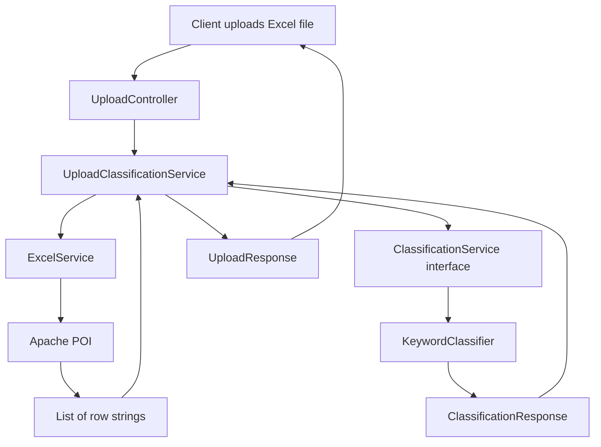
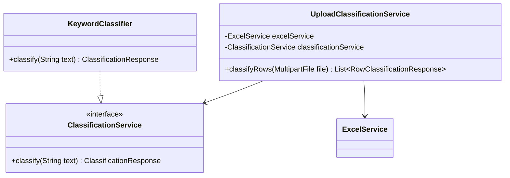
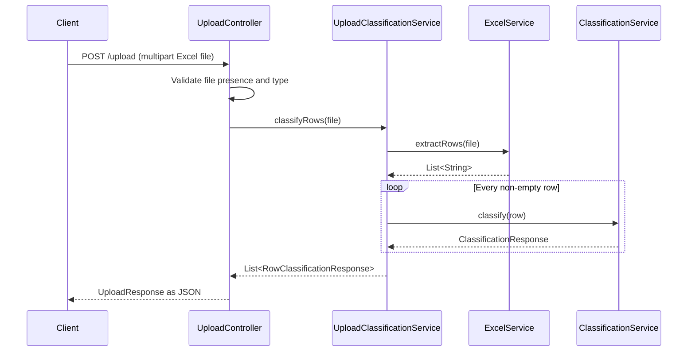
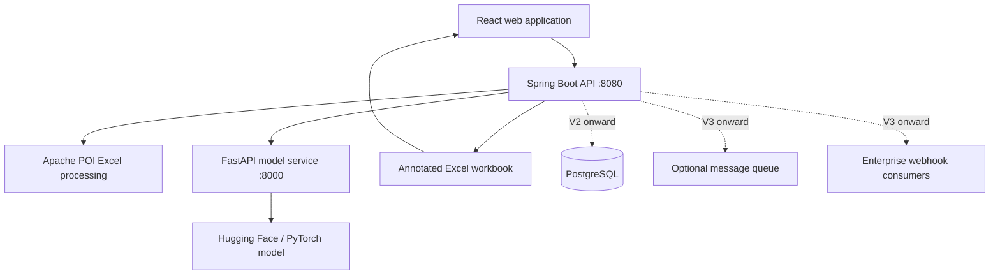
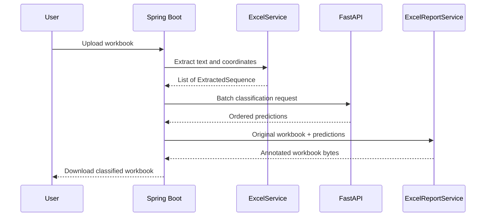

# Content Filter

Content Filter is a Spring Boot application that accepts an Excel workbook, extracts the non-empty rows from its first worksheet, classifies the text in each row, and returns structured JSON results.

The current classifier is deliberately simple and keyword-based. The application uses a `ClassificationService` interface so that another implementation, such as an AI or machine-learning classifier, can be introduced later without changing the upload workflow.

## Current capabilities

- Accept `.xls` and `.xlsx` files through `POST /upload`.
- Read the first worksheet with Apache POI.
- Convert every non-empty row into tab-separated text.
- Classify each extracted row as `abusive`, `professional`, or `neutral`.
- Return file metadata and a classification result for every extracted row.
- Expose Actuator health, liveness, and readiness endpoints.

## End-to-end architecture



In compact form:

```text
Upload Excel
     |
     v
UploadController
     |
     v
UploadClassificationService
     |
     +--> ExcelService --> List<String> rows
     |
     +--> ClassificationService (interface)
                    |
                    v
             KeywordClassifier
     |
     v
UploadResponse containing row results
```

## Classifier architecture



`UploadClassificationService` depends on the interface rather than on `KeywordClassifier`. Spring discovers `KeywordClassifier` through `@Service` and injects it as the current `ClassificationService` implementation.

If more classifier implementations are added, select the desired implementation with `@Primary`, `@Qualifier`, or configuration-based bean creation.

## Request processing sequence



## Main components

| Component | Responsibility |
| --- | --- |
| `UploadController` | Accepts the multipart request, validates the uploaded file, and constructs the API response. |
| `UploadClassificationService` | Coordinates row extraction and classification. |
| `ExcelService` | Uses Apache POI to extract non-empty rows from the first worksheet. |
| `ClassificationService` | Defines the classifier contract. |
| `KeywordClassifier` | Implements the current keyword-based classification rules. |
| `UploadResponse` | Contains uploaded-file metadata and all row results. |
| `RowClassificationResponse` | Associates an extracted row number and text with its classification. |
| `ClassificationResponse` | Contains the category, confidence, and classification timestamp. |
| `GlobalExceptionHandler` | Converts classification validation failures into structured `400 Bad Request` responses. |

## Excel extraction behavior

`ExcelService` currently:

1. Opens the workbook from the `MultipartFile` input stream.
2. Selects only the first worksheet.
3. Formats cell values with Apache POI's `DataFormatter` and evaluates formulas.
4. Joins cells in the same row using a tab character (`\t`).
5. Skips empty rows.
6. Returns an immutable `List<String>`.

The reported `rowNumber` is the one-based position in the extracted non-empty row list. It is not guaranteed to be the physical Excel row number when blank rows are present.

The first row is not treated specially. If the workbook contains a header row, that header is also classified.

## Current classification rules

| Text contains | Category |
| --- | --- |
| `stupid` or `idiot` | `abusive` |
| `regards` | `professional` |
| Anything else | `neutral` |

Matching is case-insensitive. Input must not be blank or longer than 10,000 characters. Confidence is currently a randomly generated demonstration value from `0.80` inclusive to `0.99` exclusive; it is not a model probability.

## API

### Upload and classify an Excel file

```http
POST /upload
Content-Type: multipart/form-data
```

The controller uses the first file part in the multipart request. A conventional field name such as `file` is recommended.

Example with curl:

```bash
curl -X POST \
  -F "file=@sample.xlsx;type=application/vnd.openxmlformats-officedocument.spreadsheetml.sheet" \
  http://localhost:8080/upload
```

Example response:

```json
{
  "fileName": "sample.xlsx",
  "size": 7882,
  "contentType": "application/vnd.openxmlformats-officedocument.spreadsheetml.sheet",
  "results": [
    {
      "rowNumber": 1,
      "text": "hello\tworld",
      "classification": {
        "category": "neutral",
        "confidence": 0.91,
        "timestamp": "2026-07-13T10:30:00+05:30"
      }
    },
    {
      "rowNumber": 2,
      "text": "you are stupid",
      "classification": {
        "category": "abusive",
        "confidence": 0.87,
        "timestamp": "2026-07-13T10:30:00+05:30"
      }
    }
  ]
}
```

### Health check

```http
GET /actuator/health
```

```json
{
  "status": "UP"
}
```

Container orchestration should use the more specific probes:

```text
GET /actuator/health/liveness
GET /actuator/health/readiness
```

## Response model

```text
UploadResponse
|-- fileName
|-- size
|-- contentType
`-- results: List<RowClassificationResponse>
    |-- rowNumber
    |-- text
    `-- classification: ClassificationResponse
        |-- category
        |-- confidence
        `-- timestamp
```

## Running locally

Requirements:

- Java 21 or newer
- No separate Maven installation is required because the Maven wrapper is included

On Windows PowerShell:

```powershell
.\mvnw.cmd spring-boot:run
```

On macOS or Linux:

```bash
./mvnw spring-boot:run
```

The application starts on `http://localhost:8080` by default.

To build and run the packaged application on Windows:

```powershell
.\mvnw.cmd clean package
java -jar target\contentfilter-0.0.1-SNAPSHOT.jar
```

## Tests

Run the complete test suite on Windows:

```powershell
.\mvnw.cmd test
```

The current tests verify:

- The Spring application context loads successfully.
- Keyword classification produces the supported categories.
- Classification responses contain confidence and timestamp metadata.
- Blank classification input is rejected.
- Actuator liveness and readiness probes report the application state.
- Invalid uploads use RFC 9457 Problem Details and correlation IDs.
- Documented V1 upload limits bind to validated configuration.

## Project structure

```text
src/
|-- main/java/com/example/contentfilter/
|   |-- config/           Validated external configuration
|   |-- controller/       HTTP endpoints
|   |-- dto/              Request and response records
|   |-- exception/        Application exceptions and API error handling
|   |-- service/          Excel processing, workflow coordination, classifiers
|   `-- web/              Cross-cutting HTTP concerns such as correlation IDs
`-- test/java/com/example/contentfilter/
    `-- service/          Classifier tests
```

Java package names are lowercase. The correct service package is `com.example.contentfilter.service`.

## Current limitations and cleanup candidates

- Only the first worksheet is processed.
- Header rows are not automatically skipped.
- The keyword classifier is a demonstration implementation, not a trained content-safety model.
- Confidence values are randomly generated.
- Upload validation exceptions such as an unsupported file type are not yet handled by a dedicated structured exception handler.
- `ExcelPreviewService` remains in the codebase but is not used by the active upload workflow.
- `ClassificationRequest` and `UploadRequest` are currently not used by an endpoint.
- `ClassificationResponse.categoryLower()` is currently unnecessary because `KeywordClassifier` already returns lowercase categories.

These items are documented explicitly so future work can distinguish active behavior from unfinished or legacy code.

## Suggested next steps

1. Remove or reconnect unused preview and request DTO code.
2. Add controller and multipart upload integration tests.
3. Return structured errors for every upload validation and workbook parsing failure.
4. Decide whether the first row should be treated as a header.
5. Preserve the physical worksheet row number during extraction.
6. Add a production classifier implementation behind `ClassificationService`.
7. Replace random confidence values with meaningful scores from the selected classifier.

# Product roadmap

The project will evolve through independently versioned releases. Docker will
package each deployable release, while Git tags, semantic versions, REST API
paths, and image tags will identify the version itself.

Example release identifiers:

```text
Application release: v1.0.0
REST API path:       /api/v1
Git tag:             v1.0.0
Spring image:        contentfilter-api:1.0.0
Model image:         contentfilter-model:1.0.0
```

## Version goals

### V1 — Excel profanity classification

Users upload an Excel workbook. The application extracts its text, sends it to
a content-classification model, assigns categories, applies category-specific
colours, and returns an annotated Excel workbook.

Initial colour examples:

| Category | Colour |
| --- | --- |
| Abusive | Red |
| Threat | Dark red |
| Insult | Orange |
| Obscene | Purple |
| Professional | Green |
| Neutral | Light grey |
| Manual review | Yellow |

### V2 — Authentication and usage dashboards

- User registration and login.
- Authentication and authorization through Spring Security.
- Upload counts and user scorecards.
- Upload trends displayed through bar charts.
- Category-distribution charts showing how much content was assigned to each
  classification.
- PostgreSQL persistence for users, uploads, and aggregate results.

### V3 — Enterprise webhook integration

- External systems submit chat or conversation content through a secured API.
- The service analyzes submitted content and sends results to a registered
  callback URL.
- Webhook payloads use HMAC signatures, idempotency keys, retry policies, and
  delivery audit records.
- A message queue can be introduced when asynchronous volume requires it.

### V4 — Multilingual classification

- Extend the initially English-only service to languages such as Spanish and
  German.
- Introduce language detection and a multilingual classification model.
- Evaluate category thresholds independently for each supported language.
- Retain the original language in the returned workbook and API results.

### V5 — User-configurable conversation rules

- Users configure which types of conversation should be flagged.
- Rules may cover casual language, jokes, organization-specific terminology,
  category thresholds, and communication policies.
- Store versioned rules in PostgreSQL and apply them after model inference.
- Start with a small custom rule evaluator; introduce a dedicated rules engine
  only if rule complexity makes it necessary.

# Target architecture



The Spring Boot service owns the public API and business workflow. The Python
service owns model loading and inference. Only Spring Boot should be exposed to
end users; it calls FastAPI through the internal container network.

# Production V1 baseline

"Production grade" does not mean that the application will never change. It
means that its public contracts, security boundaries, operational behavior, and
extension points are intentional and tested. The decisions below are the V1
baseline. Later versions should add capabilities without replacing the core
Excel, classification, and report contracts.

## Deployment boundary and workload model

V1 is a bounded synchronous file-processing service. It is suitable for an
internal pilot or a controlled production deployment with the following initial
limits:

| Resource | V1 limit |
| --- | --- |
| Accepted format | `.xlsx` only |
| Uploaded file size | 5 MiB |
| Worksheets processed | First worksheet only |
| Non-empty sequences | 2,000 per workbook |
| Populated cells | 100 per sequence |
| Sequence length | 4,000 Unicode characters |
| Total extracted text | 1,000,000 Unicode characters |
| Model batch size | 32 sequences |
| End-to-end request time | 60 seconds maximum |

These are configuration defaults, not unexplained constants in Java or Python.
They must be benchmarked on the actual deployment hardware before `v1.0.0` and
can be lowered without changing the API contract. Raising them requires new
load and memory tests.

Because V1 does not yet have user authentication, it must not be exposed as an
anonymous public model endpoint. Deploy it on a private network or behind an
API gateway/reverse proxy that provides access control, TLS, request-size
limits, concurrency limits, and rate limiting. V2 will move user identity and
authorization into the application.

If production workloads cannot reliably complete inside the V1 bounds, add an
asynchronous job API as an additional contract:

```text
POST /api/v1/classification-jobs
GET  /api/v1/classification-jobs/{jobId}
GET  /api/v1/classification-jobs/{jobId}/result
```

The synchronous endpoint remains available for bounded files, so this change
does not break existing clients.

## Stable domain contracts

Do not make Apache POI, Spring `MultipartFile`, HTTP DTOs, or Hugging Face
payloads the application's domain model. The core workflow should use these
technology-neutral records:

```java
public record ExtractedSequence(
        String sequenceId,
        int sheetIndex,
        int rowIndex,
        List<Integer> sourceColumnIndexes,
        String text) {
}

public record ClassificationResult(
        String sequenceId,
        ClassificationCategory primaryCategory,
        double confidence,
        Map<ClassificationCategory, Double> scores,
        boolean manualReviewRequired,
        String modelId,
        String modelRevision,
        String policyVersion) {
}
```

`sequenceId` provides explicit request/response correlation; model response
order alone is not trusted. `scores` preserves multi-label model information
even though the workbook displays one primary category. Model revision and
policy version make a result reproducible and auditable. Use an enum for
categories inside Java and stable lowercase strings at the JSON boundary.

The classifier port should be batch-first:

```java
public interface ClassificationService {
    List<ClassificationResult> classify(List<ExtractedSequence> sequences);
}
```

Single-text classification can be a convenience method, but the workflow must
not make one network call per row.

## Classification policy

Profanity, toxicity, hate speech, threats, obscenity, and professionalism are
different concepts. V1 must publish a versioned decision policy rather than
present a model score as an unquestionable fact.

Initial output categories:

```text
THREAT, ABUSIVE, INSULT, OBSCENE, PROFESSIONAL, NEUTRAL, MANUAL_REVIEW
```

The model may return several scores. A deterministic policy selects the primary
category using configured per-label thresholds and precedence. Low confidence,
conflicting labels, truncated input, or model uncertainty must produce
`MANUAL_REVIEW`. "Professional" remains a separate rules-based decision after
the harmful-content checks; a toxicity model alone cannot establish that text
is professional.

Before selecting a production model, create a versioned evaluation dataset that
represents the intended workplace/chat domain. Record per-category precision,
recall, F1, false-positive rate, false-negative rate, confusion matrix, latency,
and results for relevant language and identity slices. Thresholds are accepted
from this evidence, not chosen from a few examples. Every model or policy
change reruns the same evaluation and requires an explicit release decision.

## File-processing security

Uploaded workbooks are untrusted input. V1 uses defense in depth:

- Allow only `.xlsx`; reject `.xls`, `.xlsm`, encrypted workbooks, and other ZIP
  content.
- Treat the client filename and `Content-Type` as hints only. Validate the
  normalized extension, ZIP signature, OOXML package structure, and successful
  parsing.
- Never use the client filename as a storage path. Generate internal temporary
  names and sanitize the name used in `Content-Disposition`.
- Enforce HTTP upload size before parsing and workbook/row/cell/text limits
  while parsing to stop resource exhaustion early.
- Keep Apache POI ZIP-bomb protection enabled and configure conservative
  uncompressed-entry and extracted-text limits.
- Do not execute macros, follow external workbook links, or fetch remote
  content. Preserve formulas in the output and define whether classification
  uses the cached displayed value or a locally evaluated value.
- Process files with restricted CPU, memory, temporary storage, filesystem
  permissions, and execution time. Delete temporary material in a `finally`
  path.
- Do not persist workbook content in V1. Malware scanning is a deployment gate
  for uploads from untrusted public users, not a replacement for the controls
  above.

## Privacy and model supply chain

Uploaded conversations may contain personal, confidential, or regulated data.
The application must never log extracted text, model request bodies, workbook
contents, or returned predictions. Logs may contain a generated correlation ID,
counts, durations, byte sizes, model revision, policy version, and error code.

V1 performs inference locally. Runtime containers must not send user text to the
Hugging Face hosted inference API and should have no general internet egress.
Download the approved model during a controlled build, use `safetensors`, pin
the exact Hub commit revision and artifact checksum, review the model card and
license, and avoid `trust_remote_code=True`. Pin Python packages with hashes and
keep the model revision independent from the application version.

## API and failure contract

The V1 endpoint is:

```http
POST /api/v1/files/classify
Content-Type: multipart/form-data
Accept: application/vnd.openxmlformats-officedocument.spreadsheetml.sheet
```

The multipart field name is exactly `file`; silently selecting the first part is
not allowed. A successful response returns the annotated workbook and a safe
`Content-Disposition` filename. Errors use RFC 9457 Problem Details with
`application/problem+json`, a stable problem `type`, status, title, safe detail,
request instance/correlation ID, and application error code.

Required status behavior:

| Condition | Status |
| --- | --- |
| Invalid/missing multipart input | `400 Bad Request` |
| Unsupported workbook type | `415 Unsupported Media Type` |
| File or extracted content exceeds a limit | `413 Content Too Large` |
| Model concurrency/rate limit exceeded | `429 Too Many Requests` |
| Model timeout or unavailable | `503 Service Unavailable` |
| Unexpected internal failure | `500 Internal Server Error` |

Model responses are untrusted service input. Spring validates schema, sequence
IDs, category values, score ranges, duplicates, missing results, and extra
results before generating a report. The HTTP client uses connection and response
timeouts, does not follow redirects, and retries at most once only when the
failure is transient and the time budget permits it. There is no fallback to
the keyword classifier in production because silently changing classifiers
would make results inconsistent.

## Availability, observability, and performance

Replace the hand-written health endpoint with Spring Boot Actuator liveness and
readiness probes. Liveness reports whether the process is healthy; it must not
fail merely because the model service is temporarily unavailable. Readiness may
include model readiness so traffic stops until the application can classify.
FastAPI similarly exposes separate live and ready endpoints and loads the model
once during its application lifespan.

Minimum production telemetry:

- Request count, duration, active requests, and status by endpoint.
- Upload byte size and extracted sequence count as distributions.
- Excel parse, model inference, and report generation duration.
- Model batch size, timeout/error count, and manual-review rate.
- Result counts by category only when privacy review permits it.
- Structured logs with correlation IDs and no conversation text.

Metrics must use bounded tag values; never use filename, sequence text,
sequence ID, or user-provided category strings as metric tags. Configure
graceful shutdown and verify that in-flight requests finish within the platform
termination window.

## Testing and release gates

V1 is releasable only when all of these gates pass:

1. Unit tests cover validation, decision policy, coordinate extraction, and
   category/style mapping.
2. Contract tests cover Spring-to-FastAPI request and response schemas.
3. Golden workbook tests reopen the generated `.xlsx` and verify content,
   formulas, fills, result columns, and legend without relying on screenshots.
4. Integration tests cover multipart upload, every documented error status,
   timeout, malformed model output, and temporary-file cleanup.
5. Security tests cover disguised files, malformed OOXML, ZIP bombs, oversized
   dimensions, formula/external-link cases, and unsafe filenames.
6. Model evaluation meets agreed per-category quality thresholds and records
   known limitations; uncertain decisions remain reviewable by a human.
7. Load tests prove the documented file limits and concurrency on target
   hardware without exceeding container memory or the 60-second time budget.
8. CI builds Java and Python, runs all tests, scans dependencies and container
   images, produces an SBOM, and publishes immutable images tied to a Git SHA.
9. Containers run as non-root with read-only root filesystems, explicit CPU and
   memory limits, writable temporary mounts, health checks, and graceful stop.
10. A rollback test confirms the previous immutable image and its pinned model
    can be restored without changing the API.

## Production implementation order

Implement V1 as small vertical slices, with each slice tested before the next:

```text
0. Baseline dependencies, configuration, Problem Details, Actuator, CI
1. Upload validation and bounded coordinate-aware `.xlsx` extraction
2. Classification domain contracts and deterministic keyword test adapter
3. Versioned model evaluation dataset and model-selection report
4. FastAPI batch inference with pinned model and readiness
5. Resilient Spring-to-FastAPI adapter and contract tests
6. Annotated workbook generation and golden workbook tests
7. Versioned download endpoint and end-to-end tests
8. Containers, Compose, resource limits, telemetry, and load/security tests
9. Controlled V1 release, runbook, backup/rollback procedure
```

This order replaces the current prototype incrementally. The first code slice
should not be model integration; it should establish the safe upload and domain
contracts that every classifier and report implementation will reuse.

### Implementation progress

- [x] Module 1: baseline dependencies, validated limits, Problem Details,
  correlation IDs, Actuator probes, graceful shutdown, CI, and operational tests.
- [ ] Module 2: secure `.xlsx` validation and bounded coordinate-aware sequence
  extraction.
- [ ] Module 3: stable classification domain contracts and test adapter.
- [ ] Module 4 onward: model evaluation, FastAPI, report generation, hardening,
  and release.

## Planned technology stack

| Area | Technology | Introduced |
| --- | --- | --- |
| Backend API | Java 21, Spring Boot, Spring MVC | V1 |
| Excel processing | Apache POI 5.5.1 | V1 |
| Model API | Python, FastAPI, Uvicorn | V1 |
| Machine learning | Hugging Face Transformers, PyTorch | V1 |
| Initial model | Toxicity classifier such as `unitary/toxic-bert` or Detoxify | V1 |
| Java-to-model communication | HTTP/JSON using Spring `RestClient` | V1 |
| Frontend | React with TypeScript | V1 |
| Java testing | JUnit, Spring Boot Test, Mockito/WireMock | V1 |
| Python testing | pytest, FastAPI TestClient | V1 |
| API documentation | OpenAPI and Swagger UI | V1 |
| Packaging | Docker and Docker Compose | V1 |
| Versioning | Git, semantic versioning, GitHub releases | V1 |
| CI/CD | GitHub Actions | V1 |
| Database | PostgreSQL | V2 |
| Persistence | Spring Data JPA, Hibernate, Flyway | V2 |
| Authentication | Spring Security | V2 |
| Charts | Recharts or Chart.js | V2 |
| Webhooks | REST, HMAC signing, retry and outbox processing | V3 |
| Queue | RabbitMQ when asynchronous processing is required | V3 |
| Multilingual model | XLM-R-based toxicity classifier | V4 |
| Rules | PostgreSQL-backed custom rule configuration | V5 |
| Monitoring | Spring Actuator, Micrometer, Prometheus and Grafana | V1 |

# V1 implementation plan

## 1. Freeze the V1 scope

The recommended first release will:

- Accept `.xlsx` files initially.
- Process the first worksheet.
- Treat each non-empty extracted row as one complete sentence or text sequence.
- Preserve the original workbook content.
- Apply one classification and colour to the complete source sequence.
- Add category and confidence information.
- Add a classification legend worksheet.
- Return the modified workbook as a download.
- Enforce upload, row, cell, text-length, and model-batch limits.
- Avoid permanently storing uploaded content.

### Sequence-level classification decision

V1 deliberately performs sequence classification, not individual-word
classification. Each non-empty Excel row represents one sentence, message, or
conversation entry. If a row contains multiple populated cells, their displayed
values are joined with tab characters, matching the current `ExcelService`
behavior, and the resulting string is sent to the classifier once.

The frozen V1 classification unit is:

```text
One non-empty Excel row
          |
          v
One complete sentence/text sequence
          |
          v
One category and confidence score
          |
          v
Colour the complete source sequence
```

All text-bearing cells belonging to that sequence will receive the same category
colour. The generated workbook will also contain explicit category and
confidence values, so colour is not the only way to interpret the result.

Individual offensive words will not be identified or styled separately in V1.
That would require a profanity dictionary, token-classification model, or other
span-detection mechanism in addition to the sequence classifier and can be
considered in a later release.

### Professional classification

Toxicity models generally produce labels such as toxicity, insult, threat,
obscenity, severe toxicity, and identity hate. They do not necessarily detect
professional language.

The initial decision policy should be:

```text
Toxicity score exceeds configured threshold
    -> Use the strongest toxicity category

Otherwise professional keyword/pattern matches
    -> Professional

Otherwise
    -> Neutral
```

The existing `KeywordClassifier` can continue supplying the initial
professional-language rules.

## 2. Preserve Excel sequence coordinates

The existing `ExcelService` returns `List<String>`, which is insufficient for
locating and colouring the source sequence in the output workbook.

Introduce a coordinate-aware record:

```java
public record ExtractedSequence(
        int sheetIndex,
        int rowIndex,
        List<Integer> sourceColumnIndexes,
        String text) {
}
```

Refactor extraction to return:

```java
List<ExtractedSequence> extractSequences(MultipartFile file);
```

Use physical zero-based sheet, row, and column coordinates internally. The
source-column list records every populated cell that contributed to the joined
sequence, allowing the report generator to colour those cells consistently.
Convert coordinates to human-readable values only in API responses or reports.

## 3. Build and evaluate the Python model

Use the separate `model-service` directory:

```text
model-service/
|-- app/
|   |-- __init__.py
|   |-- main.py
|   |-- model_loader.py
|   |-- classifier.py
|   `-- schemas.py
|-- scripts/
|   `-- test_model.py
|-- tests/
|-- requirements.txt
`-- Dockerfile
```

Implementation tasks:

1. Create a Python virtual environment.
2. Install FastAPI, Uvicorn, Transformers, PyTorch, and pytest.
3. Load the chosen Hugging Face model.
4. Test safe, abusive, insulting, obscene, and threatening examples.
5. Test representative content taken from the intended workbook domain.
6. Record expected and actual predictions in a small evaluation dataset.
7. Select an initial threshold based on those results.
8. Pin the model identifier and revision for reproducible releases.

Downloaded model weights, virtual environments, secrets, and Python caches must
not be committed to Git.

## 4. Expose FastAPI inference endpoints

The model service will provide:

```http
GET /live
GET /ready
POST /api/v1/classify/batch
```

Batch request:

```json
{
  "sequences": [
    {
      "sequenceId": "sheet-0-row-0",
      "text": "Hello world"
    },
    {
      "sequenceId": "sheet-0-row-1",
      "text": "You are stupid"
    }
  ]
}
```

Batch response:

```json
{
  "model": "unitary/toxic-bert",
  "revision": "pinned-model-revision",
  "predictions": [
    {
      "sequenceId": "sheet-0-row-0",
      "category": "neutral",
      "confidence": 0.93,
      "manualReviewRequired": false,
      "scores": {
        "toxicity": 0.02,
        "insult": 0.01
      }
    },
    {
      "sequenceId": "sheet-0-row-1",
      "category": "insult",
      "confidence": 0.91,
      "manualReviewRequired": false,
      "scores": {
        "toxicity": 0.89,
        "insult": 0.91
      }
    }
  ]
}
```

The model must be loaded once during FastAPI application lifespan, not once per
request. The endpoint must validate maximum text length and batch size, echo
every sequence ID exactly once, and return consistent structured errors.

## 5. Connect Spring Boot to FastAPI

Use the batch-first classifier abstraction defined in the production baseline:

```java
public interface ClassificationService {
    List<ClassificationResult> classify(List<ExtractedSequence> sequences);
}
```

The implementation structure will become:

```text
ClassificationService
|-- KeywordClassifier
`-- HuggingFaceClassifier
```

`HuggingFaceClassifier` will call FastAPI through Spring `RestClient`. Keep the
model URL and operational settings outside the source code:

```properties
classification.provider=huggingface
classification.model-service-url=http://localhost:8000
classification.batch-size=32
classification.timeout=30s
```

When running through Docker Compose, the internal URL will be:

```text
http://contentfilter-model:8000
```

## 6. Generate the annotated workbook

Introduce an `ExcelReportService` responsible for:

1. Opening the original workbook.
2. Locating classified sequences through their saved coordinates.
3. Creating one reusable style for each category.
4. Applying the appropriate colour to every source cell in the sequence.
5. Adding category and confidence columns.
6. Creating a classification legend worksheet.
7. Writing the result to a byte array.
8. Returning a downloadable `.xlsx` file.

Do not create a separate Apache POI `CellStyle` for every cell. Reuse styles by
category to avoid workbook style limits and unnecessary memory usage.

## 7. Return the workbook through a versioned endpoint

```http
POST /api/v1/files/classify
Content-Type: multipart/form-data
```

Successful response:

```http
200 OK
Content-Type: application/vnd.openxmlformats-officedocument.spreadsheetml.sheet
Content-Disposition: attachment; filename="classified-original-name.xlsx"
```

End-to-end workflow:



## 8. Add validation and failure handling

Validate:

- File presence and non-empty content.
- `.xlsx` extension and allowed MIME type.
- Maximum upload size.
- Maximum worksheet, row, and cell counts.
- Maximum text and batch lengths.
- Workbook readability.
- Model-service availability.
- Prediction count and sequence IDs against the submitted batch.

Operational requirements:

- Connection and response timeouts.
- At most one controlled retry for transient failures.
- No uploaded conversation text in logs.
- Temporary-file cleanup.
- Structured errors for upload, workbook, model, and report failures.
- Health checks for both Spring Boot and FastAPI.

## 9. Test V1

Java tests should cover:

- Sequence extraction with physical row and column coordinates.
- Blank rows and cells.
- Formula evaluation.
- FastAPI request and response mapping.
- Category-to-colour mapping.
- Generated workbook fills and legend content.
- Multipart upload and workbook download.
- Model-service timeout and failure behavior.

Python tests should cover:

- Successful model startup.
- Health and readiness reporting.
- Batch request validation.
- Prediction order and response schema.
- Threshold-to-category mapping.
- Oversized text and batch rejection.

Maintain a small golden `.xlsx` test fixture. Reopen generated output through
Apache POI and assert its styles and values programmatically.

## 10. Dockerize V1

The repository will contain:

```text
contentfilter/
|-- Dockerfile
|-- compose.yaml
|-- src/
`-- model-service/
    `-- Dockerfile
```

Docker Compose services:

```text
contentfilter-api      Spring Boot, public port 8080
contentfilter-model    FastAPI, internal port 8000
```

Only `contentfilter-api` should be public. Add container health checks. Spring
Boot may start while the model loads, but its readiness probe must reject
traffic until model readiness succeeds; liveness must remain independent.

## 11. Add the V1 web interface

The first React/TypeScript interface should remain small:

- Drag-and-drop workbook upload.
- File type and size feedback.
- Processing indicator.
- Download button for the classified workbook.
- Category colour legend.
- Clear validation and service-error messages.

Authentication, usage scorecards, and charts remain V2 work.

## 12. Automate and release V1

Add a GitHub Actions workflow that:

1. Runs Java tests.
2. Runs Python tests.
3. Builds both Docker images.
4. Optionally runs a Docker Compose smoke test.
5. Publishes versioned images only for approved release tags.

V1 release checklist:

- All Java and Python tests pass.
- Docker Compose starts both services.
- Both health checks pass.
- The sample workbook processes successfully.
- The returned workbook opens correctly in Excel.
- Categories, confidence values, and colours match the agreed policy.
- Uploaded text is neither logged nor retained.
- Documentation contains local and container run instructions.

## V1 learning milestones

```text
Milestone 1  Establish API errors, configuration, health, and CI baseline
Milestone 2  Securely validate and extract coordinate-aware Excel sequences
Milestone 3  Freeze classification contracts and deterministic test adapter
Milestone 4  Evaluate and pin the selected Hugging Face model
Milestone 5  Expose batch predictions through FastAPI
Milestone 6  Call FastAPI safely from Spring Boot
Milestone 7  Generate and return the colour-coded workbook
Milestone 8  Add contract, integration, workbook, security, and load tests
Milestone 9  Dockerize, observe, and harden both services
Milestone 10 Add the upload interface and release v1.0.0
```

The immediate implementation target is Milestone 1 followed by Milestone 2.
Model experiments can proceed separately, but production model integration must
build on the stable upload, domain, and operational contracts.

## Reference documentation

- [OWASP File Upload Cheat Sheet](https://cheatsheetseries.owasp.org/cheatsheets/File_Upload_Cheat_Sheet.html)
- [OWASP API4: Unrestricted Resource Consumption](https://owasp.org/API-Security/editions/2023/en/0xa4-unrestricted-resource-consumption/)
- [OWASP API10: Unsafe Consumption of APIs](https://owasp.org/API-Security/editions/2023/en/0xaa-unsafe-consumption-of-apis/)
- [RFC 9457: Problem Details for HTTP APIs](https://datatracker.ietf.org/doc/html/rfc9457)
- [Apache POI security guidance](https://poi.apache.org/security.html)
- [Apache POI `ZipSecureFile` safeguards](https://poi.apache.org/apidocs/5.0/org/apache/poi/openxml4j/util/ZipSecureFile.html)
- [NIST AI Risk Management Framework](https://airc.nist.gov/airmf-resources/airmf/5-sec-core/)
- [Spring Boot container images](https://docs.spring.io/spring-boot/reference/packaging/container-images/)
- [Spring Boot production-ready features](https://docs.spring.io/spring-boot/reference/actuator/)
- [Spring Boot observability](https://docs.spring.io/spring-boot/reference/actuator/observability.html)
- [Docker Compose multi-container applications](https://docs.docker.com/get-started/docker-concepts/running-containers/multi-container-applications/)
- [FastAPI in containers](https://fastapi.tiangolo.com/deployment/docker/)
- [FastAPI lifespan events](https://fastapi.tiangolo.com/advanced/events/)
- [Hugging Face Transformers pipelines](https://huggingface.co/docs/transformers/main_classes/pipelines)
- [Hugging Face model cards](https://huggingface.co/docs/hub/model-cards)
- [Hugging Face secure model loading](https://huggingface.co/docs/transformers/main/models)
- [Apache POI spreadsheet guide](https://poi.apache.org/components/spreadsheet/quick-guide.html)
- [GitHub dependency review](https://docs.github.com/en/code-security/concepts/supply-chain-security/dependency-review)
- [GitHub build attestations and SBOMs](https://docs.github.com/en/actions/concepts/workflows-and-actions/workflow-artifacts#generating-artifact-attestations-for-builds)
- [Spring Security authentication](https://docs.spring.io/spring-security/reference/servlet/authentication/)
