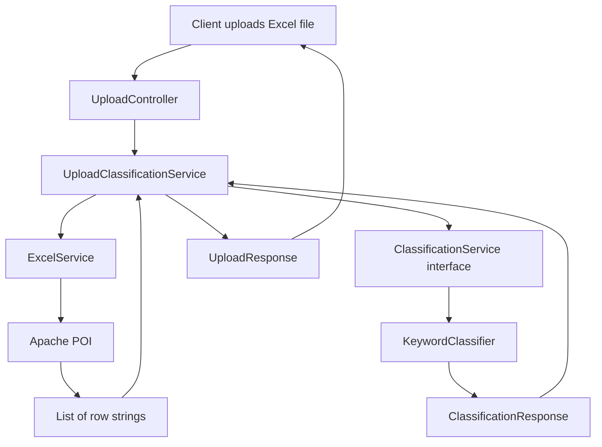
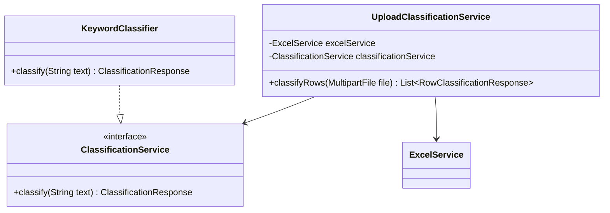
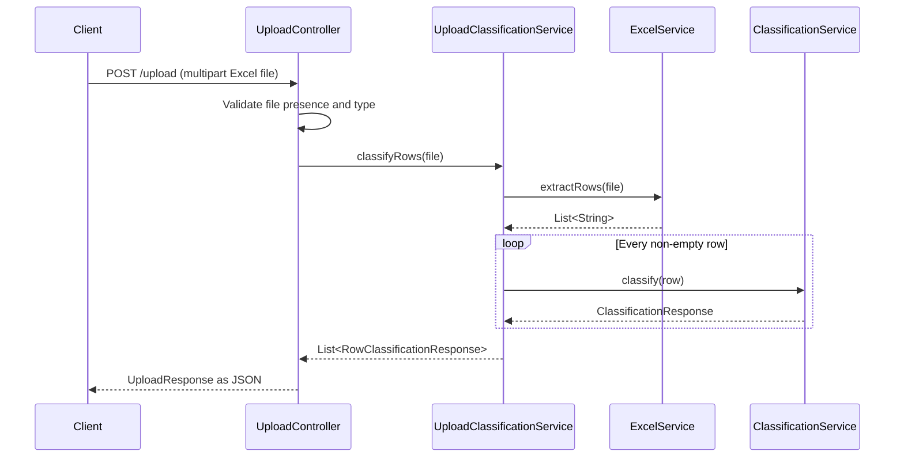

# Content Filter

Content Filter is a Spring Boot application that accepts an Excel workbook, extracts the non-empty rows from its first worksheet, classifies the text in each row, and returns structured JSON results.

The current classifier is deliberately simple and keyword-based. The application uses a `ClassificationService` interface so that another implementation, such as an AI or machine-learning classifier, can be introduced later without changing the upload workflow.

## Current capabilities

- Accept `.xls` and `.xlsx` files through `POST /upload`.
- Read the first worksheet with Apache POI.
- Convert every non-empty row into tab-separated text.
- Classify each extracted row as `abusive`, `professional`, or `neutral`.
- Return file metadata and a classification result for every extracted row.
- Expose a basic health endpoint at `GET /health`.

## End-to-end architecture



In compact form:

```text
Upload Excel
     |
     v
UploadController
     |
     v
UploadClassificationService
     |
     +--> ExcelService --> List<String> rows
     |
     +--> ClassificationService (interface)
                    |
                    v
             KeywordClassifier
     |
     v
UploadResponse containing row results
```

## Classifier architecture



`UploadClassificationService` depends on the interface rather than on `KeywordClassifier`. Spring discovers `KeywordClassifier` through `@Service` and injects it as the current `ClassificationService` implementation.

If more classifier implementations are added, select the desired implementation with `@Primary`, `@Qualifier`, or configuration-based bean creation.

## Request processing sequence



## Main components

| Component | Responsibility |
| --- | --- |
| `UploadController` | Accepts the multipart request, validates the uploaded file, and constructs the API response. |
| `UploadClassificationService` | Coordinates row extraction and classification. |
| `ExcelService` | Uses Apache POI to extract non-empty rows from the first worksheet. |
| `ClassificationService` | Defines the classifier contract. |
| `KeywordClassifier` | Implements the current keyword-based classification rules. |
| `UploadResponse` | Contains uploaded-file metadata and all row results. |
| `RowClassificationResponse` | Associates an extracted row number and text with its classification. |
| `ClassificationResponse` | Contains the category, confidence, and classification timestamp. |
| `GlobalExceptionHandler` | Converts classification validation failures into structured `400 Bad Request` responses. |

## Excel extraction behavior

`ExcelService` currently:

1. Opens the workbook from the `MultipartFile` input stream.
2. Selects only the first worksheet.
3. Formats cell values with Apache POI's `DataFormatter` and evaluates formulas.
4. Joins cells in the same row using a tab character (`\t`).
5. Skips empty rows.
6. Returns an immutable `List<String>`.

The reported `rowNumber` is the one-based position in the extracted non-empty row list. It is not guaranteed to be the physical Excel row number when blank rows are present.

The first row is not treated specially. If the workbook contains a header row, that header is also classified.

## Current classification rules

| Text contains | Category |
| --- | --- |
| `stupid` or `idiot` | `abusive` |
| `regards` | `professional` |
| Anything else | `neutral` |

Matching is case-insensitive. Input must not be blank or longer than 10,000 characters. Confidence is currently a randomly generated demonstration value from `0.80` inclusive to `0.99` exclusive; it is not a model probability.

## API

### Upload and classify an Excel file

```http
POST /upload
Content-Type: multipart/form-data
```

The controller uses the first file part in the multipart request. A conventional field name such as `file` is recommended.

Example with curl:

```bash
curl -X POST \
  -F "file=@sample.xlsx;type=application/vnd.openxmlformats-officedocument.spreadsheetml.sheet" \
  http://localhost:8080/upload
```

Example response:

```json
{
  "fileName": "sample.xlsx",
  "size": 7882,
  "contentType": "application/vnd.openxmlformats-officedocument.spreadsheetml.sheet",
  "results": [
    {
      "rowNumber": 1,
      "text": "hello\tworld",
      "classification": {
        "category": "neutral",
        "confidence": 0.91,
        "timestamp": "2026-07-13T10:30:00+05:30"
      }
    },
    {
      "rowNumber": 2,
      "text": "you are stupid",
      "classification": {
        "category": "abusive",
        "confidence": 0.87,
        "timestamp": "2026-07-13T10:30:00+05:30"
      }
    }
  ]
}
```

### Health check

```http
GET /health
```

```json
{
  "status": "UP"
}
```

### Demonstration download endpoint

`GET /download` currently returns the placeholder text `Report Content` and an `X-Report-Generated-By` response header. It does not yet generate a real report.

## Response model

```text
UploadResponse
|-- fileName
|-- size
|-- contentType
`-- results: List<RowClassificationResponse>
    |-- rowNumber
    |-- text
    `-- classification: ClassificationResponse
        |-- category
        |-- confidence
        `-- timestamp
```

## Running locally

Requirements:

- Java 21 or newer
- No separate Maven installation is required because the Maven wrapper is included

On Windows PowerShell:

```powershell
.\mvnw.cmd spring-boot:run
```

On macOS or Linux:

```bash
./mvnw spring-boot:run
```

The application starts on `http://localhost:8080` by default.

To build and run the packaged application on Windows:

```powershell
.\mvnw.cmd clean package
java -jar target\contentfilter-0.0.1-SNAPSHOT.jar
```

## Tests

Run the complete test suite on Windows:

```powershell
.\mvnw.cmd test
```

The current tests verify:

- The Spring application context loads successfully.
- Keyword classification produces the supported categories.
- Classification responses contain confidence and timestamp metadata.
- Blank classification input is rejected.

## Project structure

```text
src/
|-- main/java/com/example/contentfilter/
|   |-- controller/       HTTP endpoints
|   |-- dto/              Request and response records
|   |-- exception/        Application exceptions and API error handling
|   `-- service/          Excel processing, workflow coordination, classifiers
`-- test/java/com/example/contentfilter/
    `-- service/          Classifier tests
```

Java package names are lowercase. The correct service package is `com.example.contentfilter.service`.

## Current limitations and cleanup candidates

- Only the first worksheet is processed.
- Header rows are not automatically skipped.
- The keyword classifier is a demonstration implementation, not a trained content-safety model.
- Confidence values are randomly generated.
- Upload validation exceptions such as an unsupported file type are not yet handled by a dedicated structured exception handler.
- `ExcelPreviewService` remains in the codebase but is not used by the active upload workflow.
- `ClassificationRequest` and `UploadRequest` are currently not used by an endpoint.
- `ClassificationResponse.categoryLower()` is currently unnecessary because `KeywordClassifier` already returns lowercase categories.
- The `/download` endpoint is a placeholder.

These items are documented explicitly so future work can distinguish active behavior from unfinished or legacy code.

## Suggested next steps

1. Remove or reconnect unused preview and request DTO code.
2. Add controller and multipart upload integration tests.
3. Return structured errors for every upload validation and workbook parsing failure.
4. Decide whether the first row should be treated as a header.
5. Preserve the physical worksheet row number during extraction.
6. Add a production classifier implementation behind `ClassificationService`.
7. Replace random confidence values with meaningful scores from the selected classifier.
